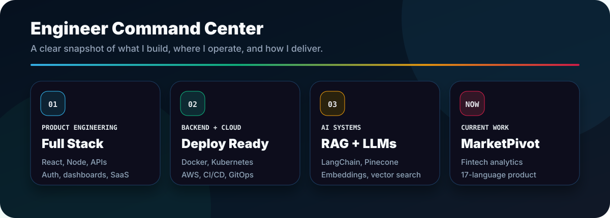
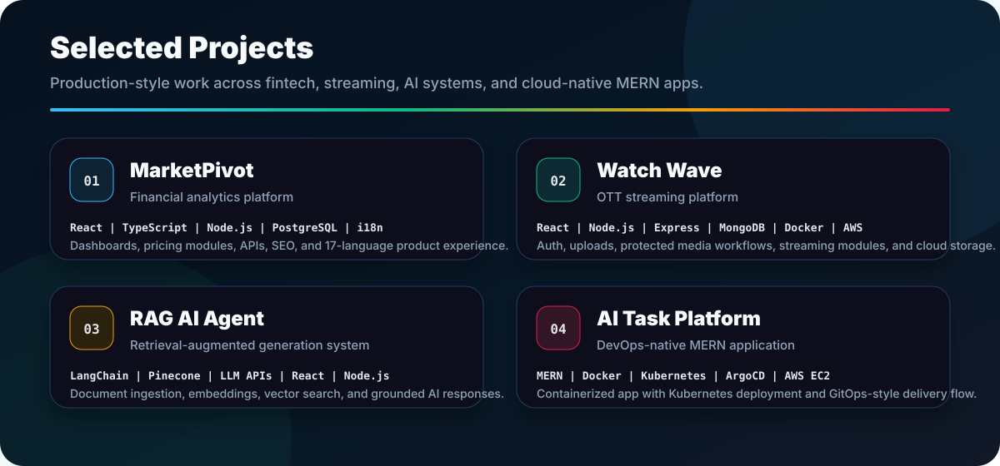

  

  <a href="https://yashchauhanportfolio.lovable.app/">Portfolio</a>
  &nbsp;|&nbsp;
  <a href="https://linkedin.com/in/yashchauhan66">LinkedIn</a>
  &nbsp;|&nbsp;
  <a href="mailto:yashchauhan6660@gmail.com">Email</a>
  &nbsp;|&nbsp;
  <a href="https://github.com/yashchauhan66">GitHub</a>

  
  
  

## About

I am **Yash Chauhan**, a **Full Stack Developer** focused on building reliable web applications, scalable backend APIs, and cloud-ready product systems. I work across frontend, backend, databases, DevOps workflows, and AI-powered features.

Currently, I am working on **MarketPivot**, a financial analytics platform with dashboards, pricing modules, backend APIs, SEO improvements, and multilingual product experience across 17 languages.

  

## Core Strengths

<table>
<tr>
<td width="50%" valign="top">

### Frontend Engineering

- React.js, Next.js, TypeScript, Tailwind CSS
- Responsive dashboards, SaaS interfaces, and admin panels
- Clean component structure, reusable UI patterns, and performance-focused pages
- Authentication flows, protected routes, forms, and API integration

</td>
<td width="50%" valign="top">

### Backend Engineering

- Node.js, Express.js, REST APIs, JWT authentication
- MongoDB, PostgreSQL, Redis, query optimization, and API performance
- Role-based access, validation, error handling, and production API structure
- Service-oriented modules for auth, users, upload, streaming, and business logic

</td>
</tr>
<tr>
<td width="50%" valign="top">

### Cloud + DevOps

- Docker, Kubernetes, GitHub Actions, AWS EC2/S3
- CI/CD workflows, deployment structure, and cloud-ready project organization
- Git workflows with feature branches, pull requests, and review discipline
- Practical GitOps exposure with ArgoCD-oriented delivery

</td>
<td width="50%" valign="top">

### AI Engineering

- LangChain, Pinecone, embeddings, vector search, and LLM APIs
- RAG pipelines with document ingestion, chunking, retrieval, and context injection
- AI workflow automation and product-level AI feature integration
- Backend orchestration with API key safety and grounded responses

</td>
</tr>
</table>

## Tech Stack

  

## Selected Projects

  

### MarketPivot - Financial Analytics Platform

**Role:** Full Stack Developer, Contract  
**Stack:** React, TypeScript, Node.js, PostgreSQL, i18n

- Building production dashboard features and UI modules for a fintech product
- Developing backend APIs and improving platform stability
- Working on multilingual product experience across 17 languages
- Improving SEO, responsiveness, pricing modules, and product workflows

### Watch Wave - OTT Streaming Platform

**Stack:** React, TypeScript, Node.js, Express.js, MongoDB, Docker, AWS EC2/S3

- Built auth, user, upload, and streaming-oriented service modules
- Implemented protected media workflows and cloud storage integration
- Structured the project for Docker-based deployment
- Created a full-stack streaming platform beyond a simple UI clone

### RAG AI Agent - Retrieval-Augmented Generation System

**Stack:** LangChain, Pinecone, LLM APIs, React, Node.js

- Built document ingestion, chunking, embeddings, vector storage, and retrieval
- Added context-injected responses to reduce hallucination
- Created a clean chat interface connected to backend orchestration
- Designed the architecture with API key safety and production-style separation

### AI Task Platform - DevOps-Native MERN App

**Stack:** MERN, Docker, Kubernetes, ArgoCD, AWS EC2

- Containerized a full-stack task management platform
- Created Kubernetes deployment structure and GitOps-style delivery flow
- Built CI/CD-oriented project organization from code to deployment
- Demonstrated cloud-native MERN deployment practices

## Delivery Process

  

## Experience

<table>
<tr>
<td width="68%" valign="top">

### Full Stack Developer, Contract

**MarketPivot** | May 2026 - Present

- Develop financial dashboards, pricing modules, and multilingual product features
- Build REST APIs with Node.js, Express.js, PostgreSQL, and production-oriented architecture
- Collaborate through branches, pull requests, code reviews, and release workflows
- Improve SEO, responsiveness, performance, and platform stability

</td>
<td width="32%" valign="top">

**Stack**

- React.js
- TypeScript
- Node.js
- PostgreSQL
- i18n
- REST APIs

</td>
</tr>
<tr>
<td width="68%" valign="top">

### Full Stack Developer, Intern

**Spring Capital** | Oct 2025 - Dec 2025

- Developed backend APIs using Node.js, Express.js, and MongoDB
- Implemented secure JWT-based authentication and authorization
- Improved API response time by 25% through query optimization and Redis caching

</td>
<td width="32%" valign="top">

**Stack**

- Node.js
- Express.js
- MongoDB
- JWT
- Redis
- API Optimization

</td>
</tr>
</table>

## Proof Signals

<table>
<tr>
<td width="50%" valign="top">

### Achievements

- Built and deployed multiple full-stack applications
- Solved 178+ DSA problems across core programming patterns
- Built a working RAG AI system with vector search
- Worked on 17-language i18n for a production fintech platform
- Improved API response time by 25% during internship work

</td>
<td width="50%" valign="top">

### Certifications

- ISRO AI/ML Certification
- Deloitte Data Analytics Certification

### Open To

- Full Stack Developer roles
- Backend Developer roles
- AI product engineering opportunities
- Remote, contract, and startup opportunities

</td>
</tr>
</table>

## GitHub Analytics

  
  

  

  

## Connect

  <a href="mailto:yashchauhan6660@gmail.com">Email</a>
  &nbsp;|&nbsp;
  <a href="https://linkedin.com/in/yashchauhan66">LinkedIn</a>
  &nbsp;|&nbsp;
  <a href="https://yashchauhanportfolio.lovable.app/">Portfolio</a>

  

